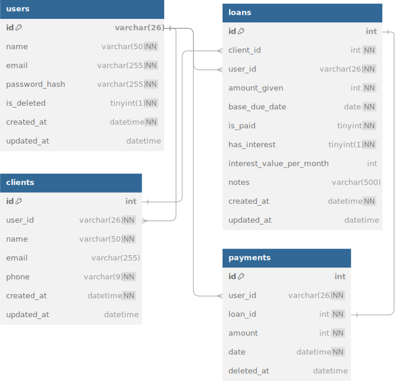

# Sistema Lendly

**Lendly** é uma aplicação backend minimalista para gestão de empréstimos informais. Desenvolvida com **Node.js**, **Fastify**, **Drizzle ORM** e **Zod**, foi projetada para oferecer um controle prático e eficiente sobre empréstimos pessoais, especialmente em contextos familiares ou informais onde métodos tradicionais de registo (como cadernos ou planilhas) são propensos a erros.

## 1. Sobre o projeto

Este sistema nasceu de uma necessidade pessoal de gerir os empréstimos realizados por mim e pela minha mãe. Anteriormente, utilizávamos cadernos para anotar valores emprestados, valores a receber, datas e nomes dos clientes — um método que frequentemente levava a confusões e esquecimentos.

O Lendly busca oferecer uma ferramenta simples, adaptada à rotina, ao mesmo tempo que serve como uma oportunidade de aprendizado no desenvolvimento backend.

Sinta-se à vontade para usar este projeto como base para estudos ou adaptá-lo às suas necessidades. Feedbacks são sempre bem-vindos!

- **Email**: [mateuscelestinofreacker@gmail.com](mailto:mateuscelestinofreacker@gmail.com)
- **LinkedIn**: [Conecte-se comigo](https://www.linkedin.com/in/mateus-nelito)

## 2. Primeiros passos

### Requisitos

Antes de instalar o projeto, certifique-se de ter o seguinte no seu ambiente:

- **Node.js** (versão 22.14.0 ou superior)

### Instalação

Siga os passos abaixo para configurar o projeto na sua máquina local:

1. **Clone o repositório**:

   ```bash
   git clone https://github.com/mateusnelito/lendly-web-api.git
   ```

2. **Acesse o diretório do projeto**:

   ```bash
   cd lendly-web-api
   ```

3. **Instale as dependências**:

   ```bash
   npm install
   ```

4. **Configure o ambiente**:

   - Crie um arquivo `.env` na raiz do projeto usando o `.env.example` como modelo. Certifique-se de preencher corretamente as variáveis de ambiente.

5. **Execute as migrações do banco de dados**:

   ```bash
   npm run db:migrate
   ```

6. **Popule o banco de dados com dados iniciais**:

   ```bash
   npm run db:seed
   ```

7. **Visualize o banco de dados**:

   - Pode utilizar qualquer gerenciador de banco de dados. Se preferir, pode abrir o Drizzle Studio com o comando:

   ```bash
   npm run db:studio
   ```

   Após executar o comando, o Drizzle Studio deve abrir automaticamente no navegador. Caso não abra, copie e cole o link manualmente. Para parar o serviço, pressione **Ctrl + C** no terminal.

8. **Inicie o servidor**:

   ```bash
   npm run start
   ```

Após completar esses passos, a API estará disponível em `http://localhost:3000`, salvo se a porta tiver sido alterada.

## 3. Documentação da API

- **Visão geral**: Este projeto utiliza Swagger para documentação interativa da API. Acesse em: [Swagger UI](http://localhost:3000/swagger).

### Principais Endpoints

#### Clientes
- `POST /clients`: Criar um novo cliente.
- `GET /clients/:id`: Obter informações de um cliente.

#### Empréstimos
- `POST /loans`: Criar um novo empréstimo para um cliente.
- `GET /loans/:id`: Obter detalhes de um empréstimo.

#### Pagamentos
- `POST /payments`: Registrar um pagamento para um empréstimo.
- `GET /payments/:id`: Obter detalhes de um pagamento.

## 4. Banco de Dados

O sistema utiliza **Drizzle ORM** com **PostgreSQL**. Abaixo está um resumo das principais entidades:

### Descrição das Entidades

- **Users (Usuários)**: Representa os usuários do sistema. Armazena nome, email e senha criptografada.
- **Clients (Clientes)**: Pessoas que recebem empréstimos. Associadas a um usuário. Podem ter vários empréstimos.
- **Loans (Empréstimos)**: Contém dados do empréstimo: valor, prazo, status, juros (opcional) e notas.
- **Payments (Pagamentos)**: Um único pagamento por empréstimo (no MVP). Inclui valor, data e suporte a soft-delete.



## 5. Manipulação de valores monetários

Para garantir precisão, os valores de `balance` e `amount` são armazenados como inteiros (em centavos). Assim, Kz 1.000,00 é armazenado como `100000`.

### Exemplo em JavaScript

```javascript
// Valor em centavos
const balanceInCents = 100000; // Representa Kz 1.000,00

// Função para formatar
function formatCurrency(cents) {
  const kwanzas = cents / 100;
  return `Kz ${kwanzas.toFixed(2)}`;
}

console.log(`Saldo: ${formatCurrency(balanceInCents)}`); // Saldo: Kz 1000.00

// Para enviar ao backend:
const amountInKwanza = 75.25;
const amountInCents = Math.round(amountInKwanza * 100);
```

## 6. Roadmap / Futuras melhorias

1. **Notificação de Empréstimos a Vencer**
   - Alerta automático para prazos de pagamento próximos.

2. **Suporte a Pagamentos Parciais**
   - Permitir múltiplos pagamentos por empréstimo.
   - Calcular saldo restante automaticamente.

3. **Confirmação de Email e Recuperação de Senha**
   - Validação de email na criação da conta.
   - Recuperação de senha via link por email.

4. **Acompanhamento de Pagamento Avançado**
   - Adição de status (pendente, confirmado).
   - Rastreabilidade e auditoria.

5. **Flexibilidade de Moeda**
   - Suporte a múltiplas moedas.
   - Definição de moeda padrão por usuário.

6. **Testes Automatizados**
   - Testes unitários e de integração usando **Jest**.

## 7. Contribuição

Este projeto é aberto a contribuições! Sinta-se à vontade para enviar Pull Requests. Estou sempre aberto a sugestões e melhorias.

- **Email**: mateuscelestinofreacker@gmail.com
- **LinkedIn**: [Conecte-se comigo](https://www.linkedin.com/in/mateus-nelito)

Obrigado pela visita e interesse!

## 8. Licença

Este projeto está licenciado sob a [Licença MIT](LICENSE).